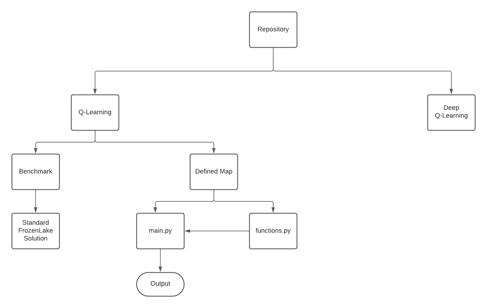
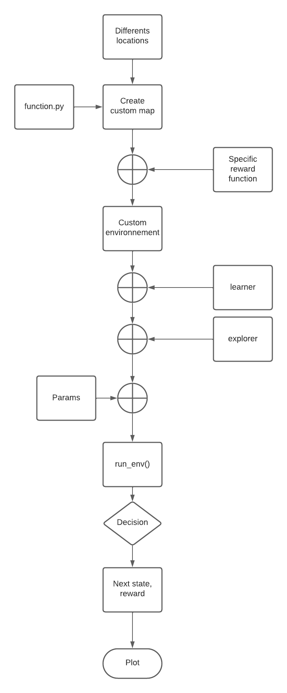

# Jumbo Mana Bypassing Solution

Illustration of the trajectory found by Q-Learning to bypass a target

## Installation

- Clone this repository, place youself in the current path then install the dependencies with :
>cd Jumbo_Mana_Bypassing \
>pip install -r requirements.txt

## Architecture

## Pipeline 

## Results replication

- Run the script main.py without changing any hyperparameters

## Solution on different map

Many hyperparameters allow the user to specify the environnement.

- epsilon (0<epsilon<1, float): it fixes the dilemma exploration (the closer to 1)/exploitation (the closer to 0)
- map_sizes (list of integers): it defines the list of square map on which you want to solve the problem
- be_sneaky (boolean): it orders if the agent has to act in a sneakish manner (set to True)
- custom_holes (list of tuple (x,y) with x and y integers): it defines the location of the holes
- custom_start (tuple (x,y) with x and y integers): it defines the starting point of the agent
- custom_goal (tuple (x,y) with x and y integers): it defines the starting point of the goal to be bypassed
- custom_rewards (int): it sets the reward for achieving the bypass successfully
- vertices (list of tuple (x,y) with x and y integers and length =3): it defines the corner of the visible triangular area
- obstacle_vertices (list of list of length 4 containing each one 4 tuples (x,y) of integers): it fixes all corner of each obstacle present in the map behind which the agent can hide

# Research phase

## Learning RL Theory

The RL framework I'll use : https://github.com/DLR-RM/stable-baselines3 \
Its documentation : https://stable-baselines3.readthedocs.io/en/master/guide/install.html \
Its tutorial : https://github.com/araffin/rl-tutorial-jnrr19 \

Hugging Face Course (the one that inspired what I've done) : https://huggingface.co/learn/deep-rl-course/unit0/introduction \
Its tutorial without Deep Learning : https://huggingface.co/learn/deep-rl-course/unit2/hands-on \
Its tutorial with Deep Learning : https://huggingface.co/learn/deep-rl-course/unit3/hands-on 

## Creating the map with homemade attributes 

Instance FrozenLake map : https://gymnasium.farama.org/environments/toy_text/frozen_lake/ \
Wrappers to define rewards and size : https://gymnasium.farama.org/api/wrappers/ 
